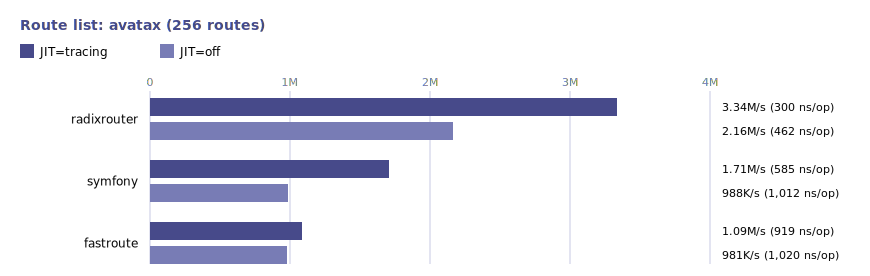
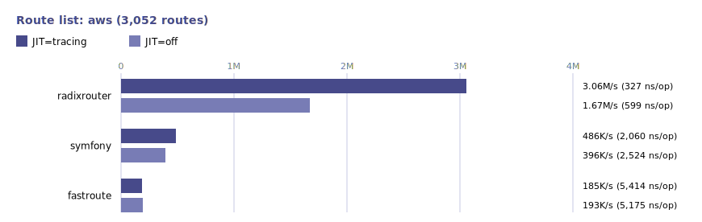
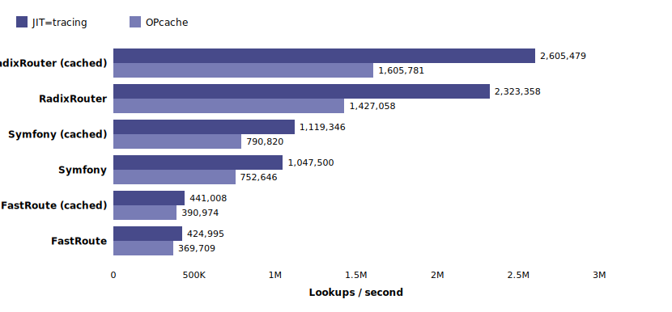
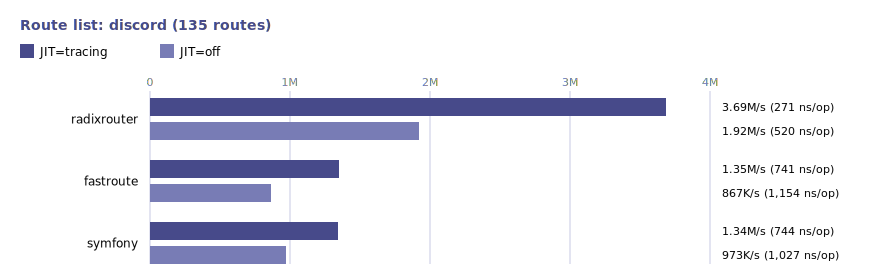
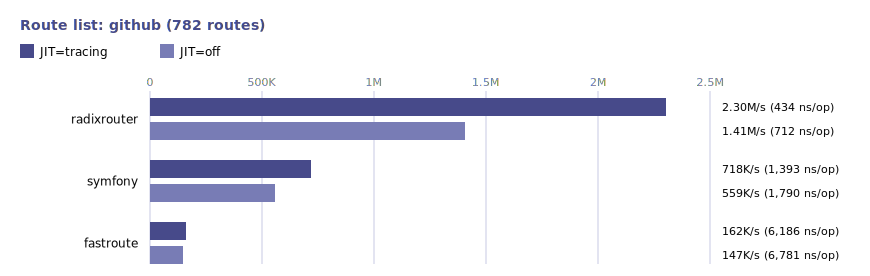
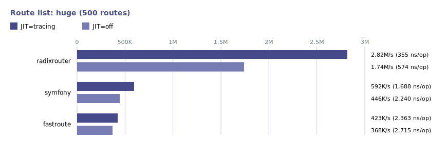
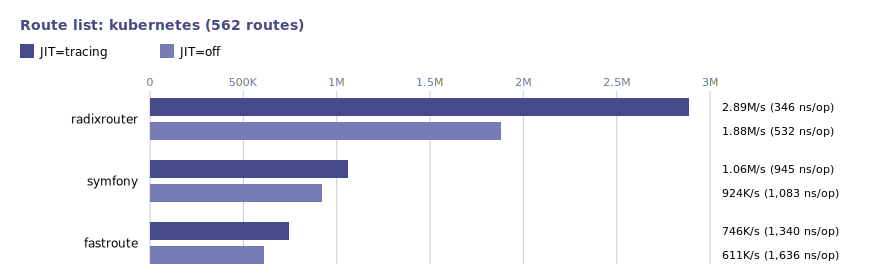
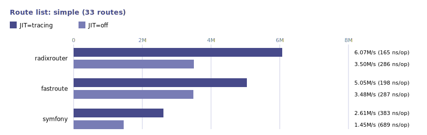
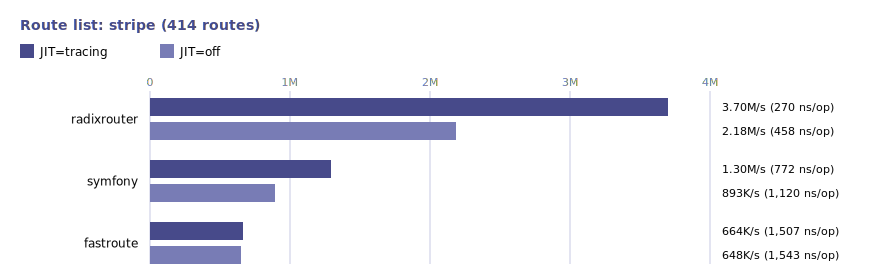

# 

[](https://packagist.org/packages/wilaak/radix-router)
[](https://packagist.org/packages/wilaak/radix-router)

A very simple radix tree based HTTP router for PHP. Use it directly, or as a base for your own router (see [integrations](#integrations)).

- Path parameters: optional and wildcard (one per segment)
- API for listing routes/methods (useful for OPTIONS)
- Automatic 405 Method Not Allowed handling
- Zero dependencies and only 377 lines of code

See [benchmarks](#benchmarks) for how it compares to others.

## Install

```bash
composer require wilaak/radix-router
```

Requires PHP 8.0 or newer.

## Usage

Below is an example to get you started using the PHP SAPI.

```PHP
<?php

require __DIR__ . '/../vendor/autoload.php';

$router = new Wilaak\Http\RadixRouter();

$router->add('GET', '/:name?', function ($name = 'World') {
    echo "Hello, {$name}!";
});

$result = $router->lookup(
    $_SERVER['REQUEST_METHOD'],
    rawurldecode(strtok($_SERVER['REQUEST_URI'], '?')),
);

switch ($result['code']) {
    case 200:
        $result['handler'](...$result['params']);
        break;
    case 404:
        http_response_code(404);
        echo '404 Not Found';
        break;
    case 405:
        header('Allow: ' . implode(',', $result['allowed_methods']));
        http_response_code(405);
        echo '405 Method Not Allowed';
        break;
}
```

### Route Configuration

Routes are matched in a predictable order, always favoring the most specific pattern. Handlers can be any value you choose. In these examples, we use strings for simplicity, but you’re free to use arrays with extra details like middleware or other metadata.

If you plan to cache your routes your handlers must be exportable (see [route caching](#route-caching)). This router does not support regex patterns and it's recommended that you handle this logic in your handlers instead.

```php
// Simple GET route
$router->add('GET', '/about', 'about');

// Multiple HTTP methods
$router->add(['GET', 'POST'], '/contact', 'contact');

// Any allowed HTTP method
$router->add($router->allowedMethods, '/maintenance', 'maintenance');

// Special fallback HTTP method (allowed or not)
$router->add('*', '/maintenance', 'maintenance');
```

### Path Parameters

Path parameters let you capture segments of the request path by specifying named placeholders in your route pattern. The router extracts these values and returns them as a map, with each value bound to its corresponding parameter name.

#### Required Parameters

Matches only when the segment is present and not empty.

```php
// Required parameter
$router->add('GET', '/users/:id', 'get_user');
// Example requests:
//   /users     -> no match
//   /users/123 -> ['id' => '123']

// You can have as many as you want, but keep it sane
$router->add('GET', '/users/:id/orders/:order_id', 'get_order');
```

#### Optional Parameters

These match regardless of whether the segment is present, and are only allowed at the end of the path.

> [!TIP]   
> Use sparingly! In most cases you’re probably better off using query parameters instead of restricting yourself to a single filtering option in the path.


```php
// Single optional parameter
$router->add('GET', '/blog/:slug?', 'view_blog');
// Example requests:
//   /blog       -> [] (no parameters)
//   /blog/hello -> ['slug' => 'hello']

// Chained optional parameters
$router->add('GET', '/archive/:year?/:month?', 'list_archive');
// Example requests:
//   /archive         -> [] (no parameters)
//   /archive/1984    -> ['year' => '1984']
//   /archive/1984/12 -> ['year' => '1984', 'month' => '12']

// Mixing required and optional parameters
$router->add('GET', '/shop/:category/:item?', 'view_shop');
// Example requests:
//   /shop/books       -> ['category' => 'books']
//   /shop/books/novel -> ['category' => 'books', 'item' => 'novel']
```

#### Wildcard Parameters

Also known as catch-all, splat, greedy, rest, or path remainder parameters; wildcards capture everything after their position in the path, including slashes. Because of this they must be used as the final segment.

> [!CAUTION]    
> Never use captured path segments directly in filesystem operations. Path traversal attacks can expose sensitive files or directories. Use functions like `realpath()` and restrict access to a safe base directory.

```php
// Required wildcard parameter (one or more segments)
$router->add('GET', '/assets/:resource+', 'serve_asset');
// Example requests:
//   /assets                -> no match
//   /assets/logo.png       -> ['resource' => 'logo.png']
//   /assets/img/banner.jpg -> ['resource' => 'img/banner.jpg']

// Optional wildcard parameter (zero or more segments)
$router->add('GET', '/downloads/:file*', 'serve_download');
// Example requests:
//   /downloads               -> ['file' => ''] (empty string)
//   /downloads/report.pdf    -> ['file' => 'report.pdf']
//   /downloads/docs/guide.md -> ['file' => 'docs/guide.md']
```

### Route Listing

Retrieve registered routes and their associated handlers. Optionally pass a request path to filter results to routes matching that path.

```php
//
// Print a formatted table of all routes
//
function print_routes_table($routes) {
    printf("%-8s  %-24s  %s\n", 'METHOD', 'PATTERN', 'HANDLER');
    printf("%s\n", str_repeat('-', 60));
    foreach ($routes as $route) {
        printf("%-8s  %-24s  %s\n", $route['method'], $route['pattern'], $route['handler']);
    }
    printf("%s\n", str_repeat('-', 60));
}

//
// List all routes
//
print_routes_table($router->list());

//
// List routes for a specific path
//
print_routes_table($router->list('/contact'));
```

Example Output:

```
METHOD    PATTERN                   HANDLER
------------------------------------------------------------
GET       /about                    about
GET       /archive/:year?/:month?   list_archive
GET       /assets/:resource+        serve_asset
GET       /blog/:slug?              view_blog
GET       /contact                  contact
POST      /contact                  contact
GET       /downloads/:file*         serve_download
*         /maintenance              maintenance
GET       /users/:id                get_user

METHOD    PATTERN                   HANDLER
------------------------------------------------------------
GET       /contact                  contact
POST      /contact                  contact
```

### Allowed Methods

Retrieve the allowed HTTP methods for a given request path.

```php
if ($method === 'OPTIONS') {
    $allowedMethods = $router->methods($path);
    header('Allow: ' . implode(',', $allowedMethods));
}
```

### Route Caching

Route caching improves performance for traditional PHP deployments where scripts are reloaded on every request. In these environments, caching routes in a PHP file allows OPcache to keep them in shared memory, reducing script startup time by eliminating the need to recompile route definitions on each request.

PHP’s engine automatically interns identical string literals at compile time. This means that when multiple routes share the same pattern, method or handler name, only a single instance of each unique string is stored in memory, reducing memory usage and access latency.

For persistent environments such as Swoole, where the application and its routes remain in memory between requests, route caching is generally unnecessary. However you may still gain some performance uplift from the aforementioned interning.

```php
$cacheFile = __DIR__ . '/route-cache.php';

if (!file_exists($cacheFile)) {
    // You must only provide cache-safe handlers that can be
    // exported by var_export() and restored with require.

    // NOT SUPPORTED:
    // $router->add('GET', '/a', fn () => 'ok');
    // $router->add('GET', '/b', function () { return 'ok'; });
    // $router->add('GET', '/c', [new MyController(), 'show']);

    $router->add('GET', '/hello',     'my_function_name');
    $router->add('GET', '/users/:id', [UserController::class, 'show']);
    $router->add('GET', '/posts/:id', [
        'uses' => [PostsController::class, 'show'],
        'name' => 'posts.show',
    ]);
    // ...continue building your routes...

    // WARNING:
    // Do not rely on the internal format of these public
    // properties without locking your version first.
    // Their structure may change at any moment and is
    // only meant for route caching purposes.
    $routes = [
        $router->tree,
        $router->static,
    ];

    // NOTE:
    // Care should be taken to avoid race conditions,
    // ensure that the cache is written atomically so that
    // each request can always load a valid cache file.
    file_put_contents($cacheFile,
        '<?php return ' . var_export($routes, true) . ';'
    );
}

$routes = require $cacheFile;
$router->tree = $routes[0];
$router->static = $routes[1];
```

### Custom HTTP methods

You can add custom HTTP methods to the router, just make sure the method names are uppercase.

```php
$customMethods = ['PURGE', 'REPORT'];
$router->allowedMethods = array_merge($router->allowedMethods, $customMethods);
```

If you want a route to match any HTTP method (including custom ones), use the fallback method:

```php
$router->add('*', '/somewhere', 'handler');
```

### Trailing Slashes in URLs

This router does not perform any automatic trailing slash redirects. Trailing slashes at the end of the request path are automatically trimmed before route matching, so both `/about` and `/about/` will match the same route.

When a route is successfully matched, the lookup method returns the canonical pattern of the matched route, allowing you to implement your own logic to enforce a specific URL format or redirect as needed.

## Important note on HEAD requests

By specification, servers must support the HEAD method for any GET resource, but without returning an entity body. In this router HEAD requests will automatically fall back to a GET route if you haven’t defined a specific HEAD route.

If you’re using PHP’s built-in web SAPI, the entity body is removed for HEAD responses automatically. If you’re implementing a custom server outside the web SAPI be sure not to send any entity body in response to HEAD requests.

## Integrations

If this router is a bit too minimalistic, you might try one of the following more high-level integrations. These are third-party so evaluate and use them at your own discretion.

| Package | Maintainer |
|---------|-------------|
| [Mezzio Framework](https://github.com/sirix777/mezzio-radixrouter) | [sirix777](https://github.com/sirix777) |
| [Yii Framework](https://github.com/sirix777/yii-radixrouter) | [sirix777](https://github.com/sirix777) |

## Benchmarks

Each path gets 1-3 HTTP methods, lookups follow a Zipf-like distribution, so a few hot routes dominate traffic.

#### Environment

- PHP 8.5.6
- AMD Ryzen 5 5600X 6-Core Processor
- Seed: 42




















## License

This library is licensed under the [MIT License](LICENSE).
